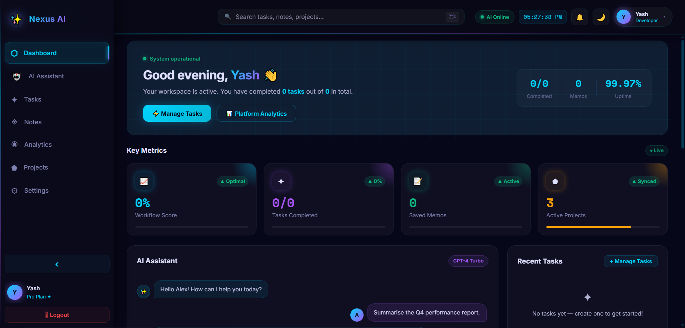
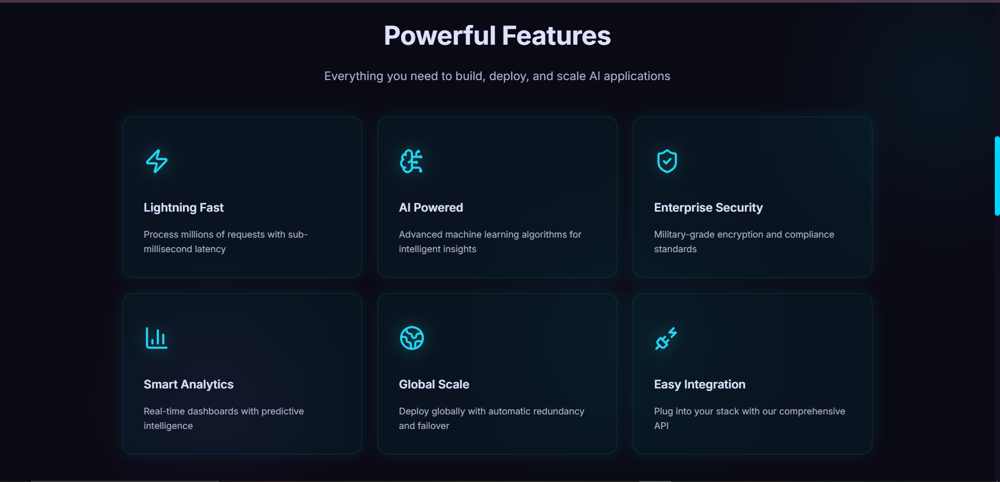

# Nexus AI

Futuristic AI-powered productivity SaaS platform built with the MERN stack, Gemini AI integration, advanced analytics, smart task management, notes workspace, and a cyberpunk-inspired modern dashboard UI.


---

# ✨ Project Overview

Nexus AI is a production-ready AI productivity platform designed to help users manage tasks, organize smart notes, monitor analytics, and interact with an AI assistant inside a futuristic cyberpunk workspace.

The platform combines:
- MERN architecture
- JWT authentication
- Gemini AI integration
- Analytics dashboard
- Smart productivity tools
- Responsive glassmorphism UI
- Cyberpunk visual design

Built for portfolio showcase, recruiter review, and modern SaaS experimentation.

---

# 🌐 Live Demo

### Frontend (Vercel)
https://nexus-ai-mu-one.vercel.app/

### Backend API (Render)
https://nexus-ai-backend-fcdy.onrender.com/

### Backend Health Endpoint
https://nexus-ai-backend-fcdy.onrender.com/api/health

---

# 🚀 Deployment

- Frontend deployed on Vercel
- Backend deployed on Render
- Database hosted on MongoDB Atlas
- AI integration powered by Gemini API

---

# 🎯 Feature Status

| Feature | Status |
| --- | --- |
| JWT Authentication | ✅ |
| Login / Signup System | ✅ |
| Protected Routes | ✅ |
| AI Assistant | ✅ |
| Gemini AI Integration | ✅ |
| Smart Task Management | ✅ |
| Notes Workspace | ✅ |
| Analytics Dashboard | ✅ |
| Cyberpunk UI | ✅ |
| Glassmorphism Effects | ✅ |
| Responsive Design | ✅ |
| MongoDB Integration | ✅ |
| Production Deployment | ✅ |
| Health Monitoring Endpoint | ✅ |
| Production-safe CORS | ✅ |

---

# 🧠 Tech Stack

## Frontend
- React
- Vite
- React Router
- Context API
- CSS3
- Responsive UI

## Backend
- Node.js
- Express.js
- MongoDB Atlas
- Mongoose
- JWT Authentication

## AI Integration
- Gemini API
- Local AI fallback system

---

# 📁 Project Structure

```text
NEXUS-AI/
├── src/
│   ├── ai/
│   ├── api/
│   ├── assets/
│   ├── components/
│   ├── context/
│   ├── pages/
│   ├── styles/
│   └── utils/
│
├── backend/
│   ├── config/
│   ├── controllers/
│   ├── middleware/
│   ├── models/
│   ├── routes/
│   ├── server.js
│   └── package.json
│
├── Screenshots/
├── .env.example
├── README.md
└── package.json
```

---

# 🔐 Environment Variables

## Frontend `.env`

```env
VITE_API_URL=https://nexus-ai-backend-fcdy.onrender.com
VITE_GEMINI_API_KEY=YOUR_GEMINI_API_KEY
```

## Backend `backend/.env`

```env
PORT=5000
NODE_ENV=development

MONGO_URI=YOUR_MONGODB_ATLAS_URI

JWT_SECRET=YOUR_STRONG_JWT_SECRET
JWT_EXPIRES_IN=7d

GEMINI_API_KEY=YOUR_GEMINI_API_KEY

ALLOWED_ORIGINS=https://nexus-ai-mu-one.vercel.app,http://localhost:3000,http://127.0.0.1:3000,http://localhost:5173,http://127.0.0.1:5173
```

---

# 🚀 Installation Guide

## 1️⃣ Clone Repository

```bash
git clone https://github.com/YashJaiman/Nexus-AI.git
```

---

## 2️⃣ Install Frontend Dependencies

```bash
npm install
```

---

## 3️⃣ Install Backend Dependencies

```bash
cd backend
npm install
```

---

## 4️⃣ Configure Environment Variables

Create:
- `.env`
- `backend/.env`

Use `.env.example` files as reference.

---

## 5️⃣ Run Backend

```bash
cd backend
npm run dev
```

---

## 6️⃣ Run Frontend

```bash
npm run dev
```

---

# 🔗 API Overview

## Base URL

```text
https://nexus-ai-backend-fcdy.onrender.com
```

---

## Authentication Routes

| Method | Endpoint |
| --- | --- |
| POST | `/api/auth/signup` |
| POST | `/api/auth/login` |
| GET | `/api/auth/me` |
| PUT | `/api/auth/profile` |
| PUT | `/api/auth/password` |
| POST | `/api/auth/logout-all` |

---

## Tasks Routes

| Method | Endpoint |
| --- | --- |
| GET | `/api/tasks` |
| POST | `/api/tasks` |
| PUT | `/api/tasks/:id` |
| DELETE | `/api/tasks/:id` |

---

## Notes Routes

| Method | Endpoint |
| --- | --- |
| GET | `/api/notes` |
| POST | `/api/notes` |
| PUT | `/api/notes/:id` |
| DELETE | `/api/notes/:id` |

---

## Analytics Routes

| Method | Endpoint |
| --- | --- |
| GET | `/api/analytics` |
| GET | `/api/analytics/dashboard-stats` |

---

## Health Route

| Method | Endpoint |
| --- | --- |
| GET | `/api/health` |

---

# 🖼️ Screenshots

### Intro Page


### Dashboard



### AI Assistant


### Tasks


### Notes


### Analytics


### Features



---

# ⚡ Production Optimizations

- Production-safe API base URL
- Dynamic environment configuration
- Vercel + Render deployment compatibility
- Production-ready CORS handling
- JWT auth persistence
- Gemini API fallback mode
- Health monitoring endpoint
- Optimized Vite production build

---

# ✅ Production Checklist

| Checklist | Status |
| --- | --- |
| Frontend deployed on Vercel | ✅ |
| Backend deployed on Render | ✅ |
| MongoDB Atlas connected | ✅ |
| Gemini API integrated | ✅ |
| JWT Authentication working | ✅ |
| Protected routes enabled | ✅ |
| Health endpoint active | ✅ |
| Responsive UI completed | ✅ |
| Production build successful | ✅ |
| Environment variables configured | ✅ |

---

# 🔮 Future Improvements

- Real-time team collaboration
- AI-generated productivity reports
- Voice assistant integration
- Calendar synchronization
- Notifications system
- AI workflow automation
- Admin analytics panel

---

# 👤 Author

**Yash Jaiman**  
MERN Stack & AI Developer

---

# 📄 License

ISC License

---

# 🏷️ Suggested GitHub Topics

```text
mern
react
vite
mongodb
express
nodejs
jwt-auth
gemini-api
ai-saas
dashboard
productivity-app
cyberpunk-ui
glassmorphism
vercel
render
```

Built with passion for futuristic UI/UX, AI experiences, and modern full-stack development.